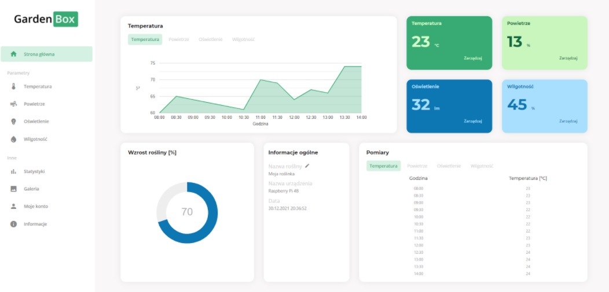

# GardenBox

## Table of contents
* [General info](#general-info)
* [Overview](#overwiev)
## General info
GardenBox is an application that allows you to control and monitor the plant growth process. Application is built with Angular.

## Overview
