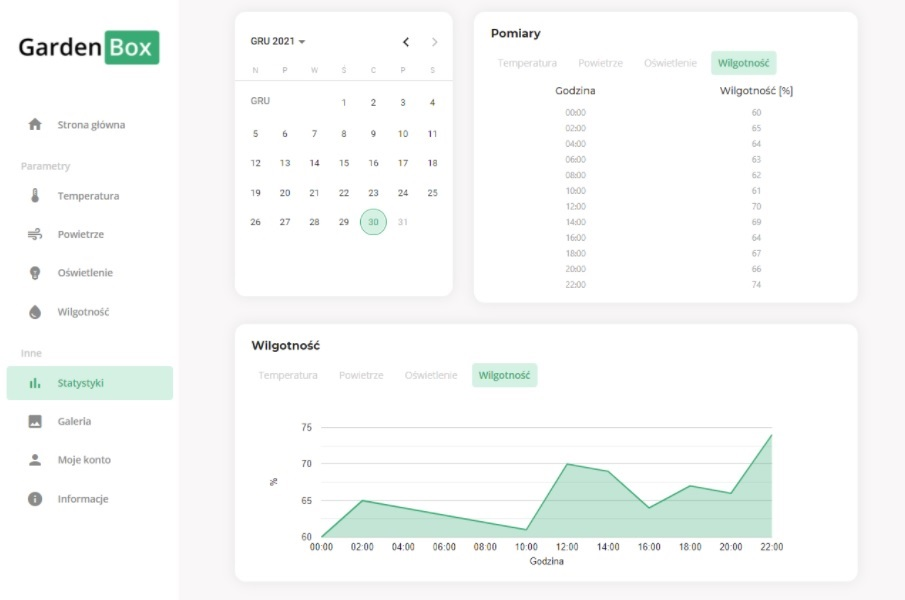
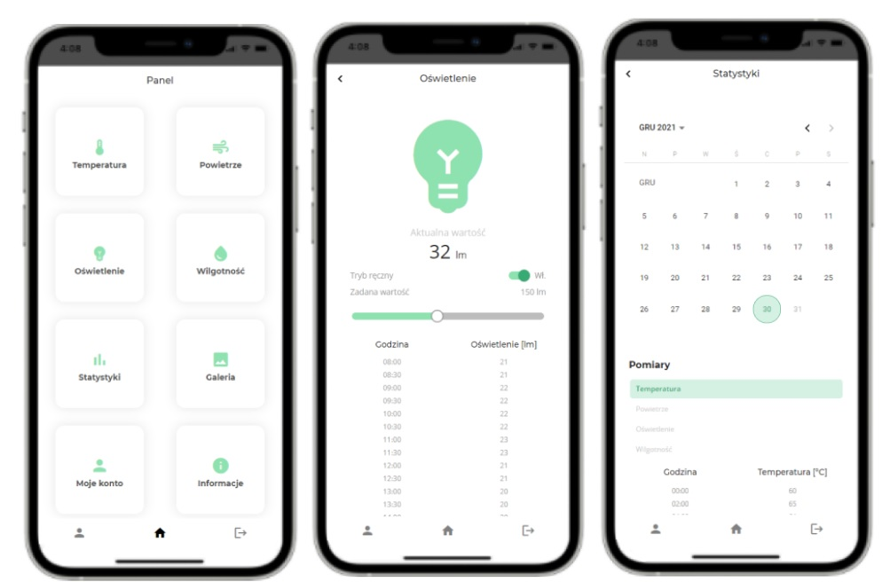

# GardenBox

## Table of contents
* [General info](#general-info)
* [Overview](#overwiev)
* [Statistics](#statistics)
* [Mobile devices](#mobile)
* [Technologies](#technologies)

## General info
GardenBox is an application that allows you to control and monitor the plant growth process. Application is built with Angular.

## Overview

The application allows you to view the measurements taken in real time from the sensors and present them in a table and on a graph.

## Statistics
The user can check the statistics and measurement results from different days. This can be done by selecting the appropriate day in the calendar in the upper left corner and selecting the parameter of interest by clicking on the label at the top of the table / graph.

## Mobile devices
To improve the application experience, a mobile-first approach was used - first the focus was on users of mobile phones and other mobile devices, designing and implementing views in such a way that it is easy to use the application with only a thumb or fingers. Next, the focus was on adjusting the displayed content for devices with higher resolution, i.e. laptops and monitors, trying to place all the information necessary for the user in a convenient place for him.

## Technologies
* Angular 12.0.3,
* Sequelize 6.7.0,
* Socket.io 4.2.0,
* Sqlite3 5.0.2,
* Express 4.17.1
